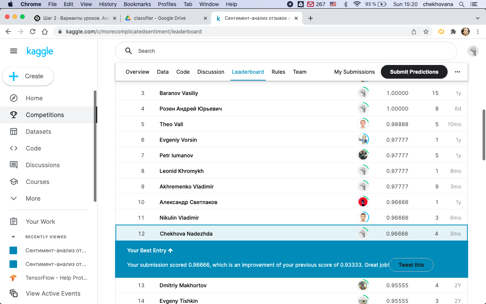

Теперь вы готовы окунуться в более агрессивную симуляцию реальной жизни. Вам нужно будет разработать модель, которая будет давать точные прогнозы на тестовой выборке заказчика, но обучающую выборку для вас собрать не готовы - придется выкручиваться самостоятельно. Усугубляет ситуацию то, что вы даже не знаете ответов на выборке заказчика, но можете периодически отправлять свои прогнозы на проверку.

# Разработка сентимент-анализа под задачу заказчика

К вашей компании пришел заказчик, которому нужно решение задачи анализа тональности отзывов на товары. Заказчик хочет, чтобы вы оценили возможное качество работы такого алгоритма на небольшой тестовой выборке. При этом больше никаких данных вам не предоставляется. Требуется, чтобы качество работы вашего алгоритма (по accuracy) было строго больше 85%.

Оценка качества в этом задании реализована через контест на Kaggle Inclass:

https://www.kaggle.com/c/morecomplicatedsentiment

Вам предстоит посмотреть на предоставленные заказчиком отзывы, собрать похожие отзывы в качестве обучающей выборки, и поэкспериментировать с постановкой задачи (разметкой вашей выборки на позитивные и негативные примеры) так, чтобы результат на примерах заказчика был по возможности получше.

Обратите внимание, что заказчик предоставил всего 100 примеров в качестве тестовой выборки - ситуация, когда размеченных данных почти нет - вообще очень частая в индустриальном анализе данных. Конечно, эти отзывы можно было бы идеально разметить вручную и получить максимальное качество, но вы сами не заинтересованы в таком подходе, т.к. потом придется и на всех новых примерах демонстрировать заказчику идеальную работу, что, конечно, вряд ли будет по силам алгоритму. В любом случае рано или поздно алгоритм придется разрабатывать, поэтому попытки "сжульничать" и не делать никакой модели не одобряются.

В качестве ответа в этом задании вам нужно загрузить ноутбук с решением и скриншот вашего результата на leaderboard.

Убедитесь, что:

1) ход вашего решения задокументирован достаточно подробно для того, чтобы ваши сокурсники поняли, что вы делали и почему;

2) ваша команда в соревновании состоит только из вас и названа вашим логином на Stepik, чтобы ваши сокурсники могли понять, что на скриншоте именно ваш результат.

# Результат

